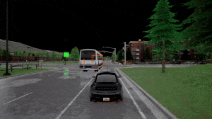

# 📷 Cooperative Perception with Edge Communication: EI-Drive 🚕

<div align="center">
    <a href="">
        
        EI-Drive API Documents
    </a>
    &nbsp;|&nbsp;
    <a href="">
        
        ArXiv Pre-print
    </a>
    &nbsp;|&nbsp;
    <a href="">
        
        Project Page
    </a>

</div>


______________________________________________________________________

Experience the seamless integration of **cooperative perception** and **edge communication** in autonomous driving simulation.
<!-- 
> \[!NOTE\]
>
> - **August 2024:** Support transmission error in intention sharing. -->


## **Looking for an advanced autonomous driving platform that seamlessly simulates cooperative perception and edge communication? Choose EI-Drive!**

Integrating cooperative perception with edge communication, EI-Drive allows the exploration how communication latency and errors affect not only cooperative perception but also the overall performance of autonomous vehicles.

A streamlined implementation with an end-to-end pipeline and built-in scenarios. Highly customizable components allow you to tailor your experiments.

Clear visualization makes the results highly visible and easy to interpret.

## 🚗 Edge-Intelligence Autonomous Driving Platform

An open-source platform provides solution for joint simulation of edge communication and cooperative perception, aimed at safe and efficient cooperative driving automation.

- 🌞 **AV pipeline**: An end-to-end pipeline encompassing environment, sensing, perception, planning, and control.
- 📸 **Cooperative perception**: Flexible cooperative perception with customizable agents, methods, tasks, and visualization.
- 📡 **Transmission model**: Simulate the key characteristics, transmission latency and errors, in data transmission between the edge agents, interacting seamlessly with the perception module.


**Documentation: [EI-Drive API Documents]()**

**Looking for more techincal details? Check our report here! [Paper link]()**

## 🎯 Experiment Demo

### Cooperative perception
EI-Drive has various built-in scenarios tailored for cooperative perception experiments, where the spectator vehicles and RSUs share perception information with the ego vehicle. Multiple cooperative perception tasks, including collision avoidance and traffic flow detection, enable extensive research with different goals.

The perception results have significant influences on the ego vehicle's behavior. The ego vehicle benefits from cooperative perception with less blind spots (rows 1 & 2) and wider detection range (row 3).

<table style="border-collapse: collapse;">
  <tr style="border: none;">
    <td align="center" style="border: none; padding: 0;">
      
      <br><b>Ego vehicle</b>
    </td>
    <td align="center" style="font-size: 20px; line-height: 1.2; font-weight: bold; border: none;">➕</td>
    <td align="center" style="border: none; padding: 0;">
      
      <br><b>Spectator vehicle</b>
    </td>
    <td align="center" style="font-size: 20px; line-height: 1.2; font-weight: bold; border: none;">➡️</td>
    <td align="center" style="border: none; padding: 0;">
      
      <br><b>Cooperative perception</b>
    </td>
  </tr>
</table>

<table style="border-collapse: collapse;">
  <tr style="border: none;">
    <td align="center" style="border: none; padding: 0;">
      
      <br><b>Ego vehicle</b>
    </td>
    <td align="center" style="font-size: 20px; line-height: 1.2; font-weight: bold; border: none;">➕</td>
    <td align="center" style="border: none; padding: 0;">
      
      <br><b>RSU</b>
    </td>
    <td align="center" style="font-size: 20px; line-height: 1.2; font-weight: bold; border: none;">➡️</td>
    <td align="center" style="border: none; padding: 0;">
      
      <br><b>Cooperative perception</b>
    </td>
  </tr>
</table>

<table style="border-collapse: collapse;">
  <tr style="border: none;">
    <td align="center" style="border: none; padding: 0;">
      
      <br><b>Ego vehicle</b>
    </td>
    <td align="center" style="font-size: 20px; line-height: 1.2; font-weight: bold; border: none; padding: 17px;">➕</td>
    <td align="center" style="border: none; padding: 0;">
      
      <br><b>RSU</b>
    </td>
    <td align="center" style="font-size: 20px; line-height: 1.2; font-weight: bold; border: none;">➡️</td>
    <td align="center" style="border: none; padding: 0;">
      
      <br><b>Cooperative perception</b>
    </td>
  </tr>
</table>


### Transmission latency and errors
EI-Drive has great flexibility to simply apply transmission latency and errors to any perception processes, allowing the researches across both communication and autonomous driving. The transmission latency and errors not only impair the performance of cooperative perception, but also have negtive influence to the behavior of the ego vehicle.

<table style="border-collapse: collapse; width: 100%;">
  <tr style="border: none;">
    <td align="center" valign="top" style="border: none; padding: 0px 10px;">
      
      <br><b>Cooperative perception</b>
      <br>✅
    </td>
    <td align="center" valign="top" style="border: none; padding: 0px 10px;">
      
      <br><b>Cooperative perception + Transmission errors</b>
      <br>❌
    </td>
    <td align="center" valign="top" style="border: none; padding: 0px 10px;">
      
      <br><b>Cooperative perception + Transmission latency</b>
      <br>❌
    </td>
  </tr>
</table>

<table style="border-collapse: collapse; width: 100%;">
  <tr style="border: none;">
    <td align="center" valign="top" style="border: none; padding: 0px 10px;">
      
      <br><b>Cooperative perception</b>
    </td>
    <td align="center" valign="top" style="border: none; padding: 0px 10px;">
      
      <br><b>Cooperative perception + Transmission errors</b>
    </td>
    <td align="center" valign="top" style="border: none; padding: 0px 10px;">
      
      <br><b>Cooperative perception + Transmission latency</b>
    </td>
  </tr>
</table>


### Perception methods and multi-modality
EI-Drive supports multiple perception methods and multi-modal sensor inputs, greatly enriches the experiment settings.
<table style="border-collapse: collapse; width: 100%;">
  <tr style="border: none;">
    <td align="center" style="border: none; padding: 0px 10px;">
      
      <br><b>Multi-modal inputs</b>
    </td>
    <td align="center" style="border: none; padding: 0px 10px;">
      
      <br><b>Multiple perception methods</b>
    </td>
  </tr>
</table>


## 💻 Prerequisites

**First, we need to install CARLA**. Download [CARLA release](https://github.com/carla-simulator/carla/releases) of version ``0.9.14`` as we experiemented with this version.

Set the following environment variables:
```bash
export CARLA_ROOT=/path/to/carla 
export PYTHONPATH="$CARLA_ROOT/PythonAPI/carla/":"$CARLA_ROOT/PythonAPI/carla/dist/carla-0.9.14-py3.7-linux-x86_64.egg":${PYTHONPATH}
```

To verify that CARLA has been correctly installed, run the command:
```bash
cd carla/
./CarlaUE4.sh
```

**Second, setup the environment for EI-Drive**. Clone the repository:

```bash
git clone https://github.com/ucd-dare/EI-Drive
cd EI-Drive
```

Create the EI-Drive environment using conda:

```bash
conda env create -f environment.yml
conda activate EI-Drive
cd EI-Drive
python setup.py develop
.setup.sh
```

**To run EI-Drive**, make sure the CARLA is running in the meanwhile. You may use two terminals:
```bash
cd carla/
./CarlaUE4.sh
```
```bash
cd EI-Drive/
python EI_Drive.py
```

## 🏇 Quick Start

### Scenario and Config
To run a specific scenario, use

```bash
python EI_Drive.py test_scenario=coop_perception_1
```

The command runs the script ``coop_perception_1.py``, following the configuration file in the folder ``scenario_testing/config_yaml/config.yaml``. The config files in EI-Drive are structured hierarchically:

```bash
config.yaml/
├── test_scenario/              (Designate the scenario)
|   ├── common_params
|   ├── vehicle_perception      (Perception method)
|   ├── vehicle_localization    (Localization method)
|   ├── game_map
|   ├── behavior
|   ├── controller
|   ├── traffic_manager
|   └── scenario
└── world/                      (Designate the weather)
    ├── sunny.yaml
    └── ... 

```

The default perception method is oracle with blue bounding boxes, to enable object detection by YOLOv5

```bash
python EI_Drive.py test_scenario=coop_perception_1 test_scenario.vehicle_perception.perception.activate=true test_scenario.vehicle_perception.perception.model=yolo
```

To simplify the usage of lengthy commands, we have packaged common configurations as modules. It is **recommended** to utilize these modules in the configuration file for specific scenarios. For instance, to achieve the same outcome as the command mentioned above, you can set ``vehicle_perception: perception_true`` in the config file ``coop_perception_1.yaml``, where config module ``perception_true.yaml`` is applied.

### Cooperative Perception
To enable cooperative perception, open the config file in ``test_scenario/scenario/coop_perception_1.yaml`` that defines the details of the scenario. Set ``coop_perception: true`` for the ego vehicle with ``id=0`` and the participant (RSU in this scenario) with ``id=-1``. To disable it, set ``coop_perception: false`` for the ego vehicle.

Then run the simulation
```bash
python EI_Drive.py test_scenario=coop_perception_1
```

💡 Please note that this config file is a different file with ``test_scenario/coop_perception_1.yaml`` abovementioned, even they have the same name.

### Transmission Latency and Errors
To enable latency and errors, open the config file in ``test_scenario/scenario/coop_perception_1.yaml`` that defines the details of the scenario. Set ``transmission_latency: true`` and ``errors: true`` for the ego vehicle with ``id=0`` and the participant (RSU in this scenario) with ``id=-1``.

Then run the simulation
```bash
python EI_Drive.py test_scenario=coop_perception_1
```

💡 Please ensure ``coop_perception: true`` has been set for the RSU and the ego vehicle, since the latency and errors work when the data transmission exists.

## 🌟 Citation

If you find this repository useful, please cite this paper:

**[Paper link]()**
```
@article{
}
```

## 👥 Contributors

Special thanks to the community for your valuable contributions and support in making CarDreamer better for everyone!

<!-- readme: contributors -start -->
<table>
	<tbody>
		<tr>
            <td align="center">
                <a href="https://github.com/HanchuZhou">
                    
                    <br />
                    <sub><b>Hanchu Zhou</b></sub>
                </a>
            </td>
            <td align="center">
                <a href="https://github.com/gaodechen">
                    
                    <br />
                    <sub><b>GaoDechen</b></sub>
                </a>
            </td>
		</tr>
	<tbody>
</table>
<!-- readme: contributors -end -->
